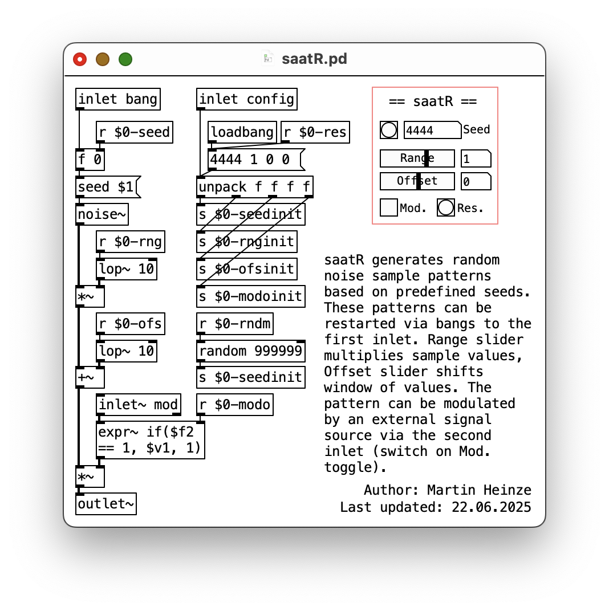
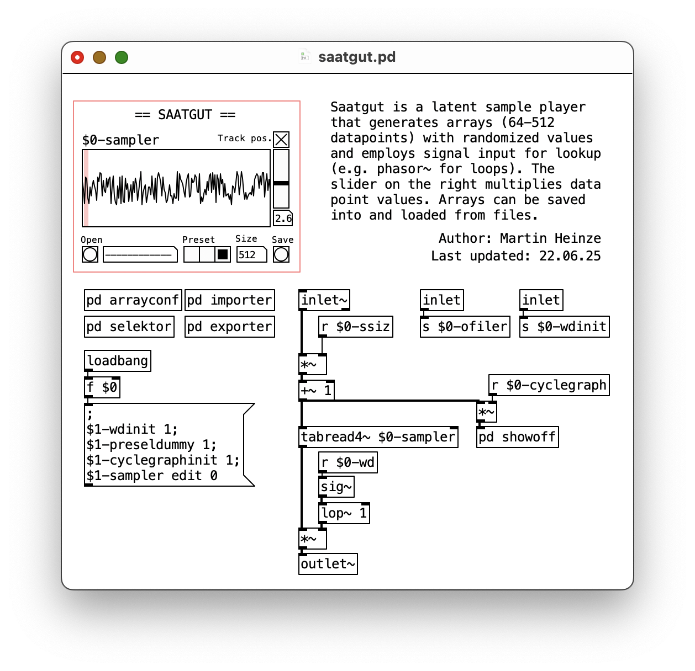
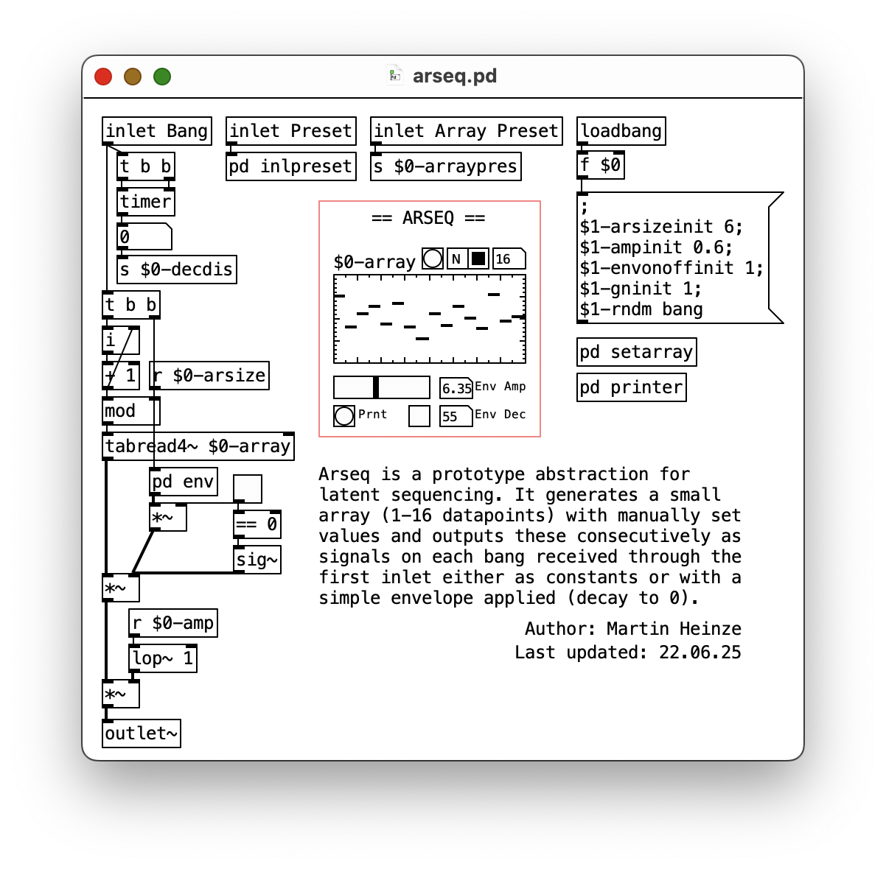
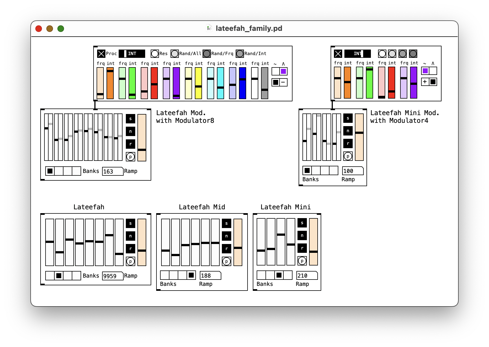
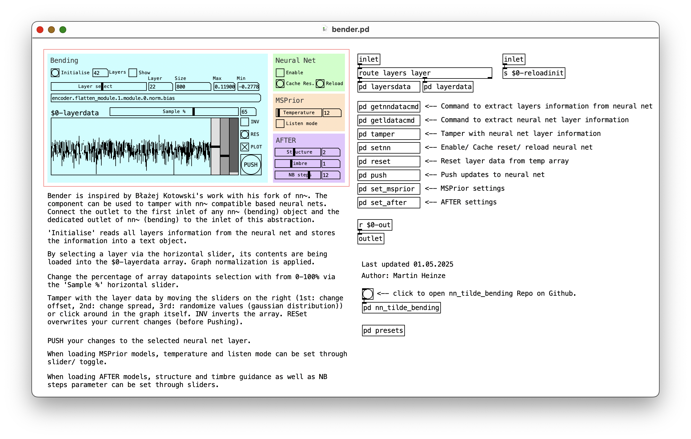

# PD-latent-jamming
**Latent Jamming** is a combination of techniques and practices of real time intervention in the latent space of [nn~](https://github.com/acids-ircam/nn_tilde) compatible neural audio models (e.g. [RAVE](https://github.com/acids-ircam/RAVE), [VSCHAOS2](https://github.com/acids-ircam/vschaos2), [MSPrior](https://github.com/caillonantoine/msprior) or [AFTER](https://github.com/acids-ircam/AFTER)). \
This repository contains abstractions written in Pure Data that mimick latent embeddings and can be used for generative neural audio synthesis. \
 \
*Latest version:* version

## Abstractions
### saatR

saatR generates random noise sample patterns based on predefined seeds. These patterns can be restarted via bangs to the first inlet. *Range* slider multiplies sample values, *Offset* slider shifts window of values. The pattern can be modulated by an external signal source via the second inlet (switch on Mod. toggle).
### Saatgut

Saatgut is a latent sample player that generates arrays (64-512 datapoints) with randomized values and employs signal input for lookup (e.g. phasor~ for loops). The slider on the right multiplies data point values. Arrays can be saved into and loaded from files.
### arseq

Arseq is a prototype abstraction for latent sequencing. It generates a small array (1-16 datapoints) with manually set values and outputs these consecutively as signals on each bang received through the first inlet either as constants or with a simple envelope applied (decay to 0).
### Lateefah

Lateefah is a family of multichannel signal generators with storage banks that conserves offset constellations for latent dimensions (think: sound presets). The *Modulator* addons semi-automatically browse through the vicinity of the values stored in order to create organically moving sound shifts.
### Bender

Bender is inspired by [Błażej Kotowski's work](https://github.com/blazejkotowski) with his fork of nn~ ([nn~ bending](https://github.com/blazejkotowski/nn_tilde_bending)).
The component exposes the neural net's weights and biases and can be used to tamper with the model e.g. manually overwrite, shift or randomize a given percentage of datapoints in the neural nets layers. The abstraction comes with additional controls for [MSPrior](https://github.com/caillonantoine/msprior) and [AFTER](https://github.com/acids-ircam/AFTER) models.
## Licence
<a href="https://github.com/devstermarts/PD-latent-jamming">PD Latent Jamming</a> © 2025 by <a href="https://github.com/devstermarts">Martin Heinze</a> is licensed under <a href="https://creativecommons.org/licenses/by-sa/4.0/">CC BY-SA 4.0</a>
